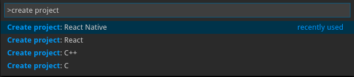

# project-generator README
Generate based for C, C++, React and React Native project.

## Requirements
**C and C++ :**
  - On Windows you must install mingw
  - On linux you have to install gcc and make

**React Native :**
- You HAVE to install `react-native-cli`.

Use this command line if you don't have react-native-cli installed :

    npm install -g react-native-cli

## Command available

___
 
More language and option will come after.
Like sample dasboard in React and React Native...

Enjoy :)
___

**Adrien Guezennec**
 
adrien.guezennec@gmail.com